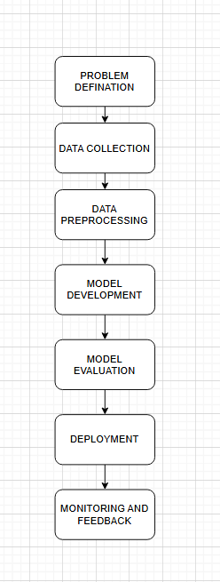

# AI Development Workflow Assignment Report

## Part 1: Short Answer Questions

### 1. Problem Definition

**Problem:** Predicting student dropout rates in universities.

**Objectives:**
- Detect at-risk students early.
- Enable timely interventions.
- Reduce dropout rates by 20% in 2 years.

**Stakeholders:**
- University Administration
- Students & Guardians

**Key KPI:** Model Accuracy (>85%)

---

### 2. Data Collection & Preprocessing

**Data Sources:**
- University academic records
- Learning management system (LMS) logs

**Potential Bias:**
Low-income students may have incomplete data, skewing model accuracy.

**Preprocessing Steps:**
- Handle missing values via imputation.
- Normalize GPA and attendance rates.
- One-hot encode categorical fields.

---

### 3. Model Development

**Model Chosen:** Random Forest

**Reason:** Handles tabular data well, interpretable, avoids overfitting.

**Data Split:**
- Training: 70%
- Validation: 15%
- Test: 15%

**Hyperparameters:**
- `n_estimators`: Number of trees
- `max_depth`: Controls overfitting

---

### 4. Evaluation & Deployment

**Evaluation Metrics:**
- Precision: Minimizes false positives
- Recall: Maximizes true positives (catch all dropouts)

**Concept Drift:**  
When data distribution changes over time.  
**Monitoring:** Scheduled retraining and performance alerts.

**Deployment Challenge:**  
Ensuring model scales across departments with different systems.

---

## Part 2: Case Study – Hospital Readmission Prediction

### Problem Scope

**Problem:** Predict risk of patient readmission within 30 days.

**Objectives:**
- Reduce readmission costs
- Improve post-discharge care

**Stakeholders:**
- Hospital Admin
- Medical Staff

---

### Data Strategy

**Data Sources:**
- Electronic Health Records (EHRs)
- Patient Demographics

**Ethical Concerns:**
1. Privacy of patient records
2. Model bias against age groups

**Preprocessing:**
- Remove missing clinical entries
- Encode diagnosis codes
- Create new features (e.g. past readmission count)

---

### Model Development

**Model:** Logistic Regression (baseline)

**Confusion Matrix:**

|                | Predicted Yes | Predicted No |
|----------------|---------------|--------------|
| Actual Yes     | 30            | 10           |
| Actual No      | 8             | 52           |

**Precision:** 30 / (30+8) = 0.789  
**Recall:** 30 / (30+10) = 0.75

---

### Deployment

**Integration:**
- Serve via API into hospital system
- Connect to dashboards

**Compliance:**
- Use HIPAA encryption and access control
- Perform audits regularly

---

### Optimization

**Overfitting Strategy:**  
Use L2 Regularization to reduce complexity

---

## Part 3: Critical Thinking

### Ethics & Bias

**Risk:** Biased training data could mispredict for minorities or the elderly.  
**Strategy:** Use fairness-aware algorithms and balance dataset classes.

---

### Trade-offs

**Interpretability vs. Accuracy:**  
Complex models may be accurate but are black boxes. Healthcare needs explainability.

**Low Resources Impact:**  
Choose lightweight models (e.g., logistic regression) for lower CPU use.

---

## Part 4: Reflection & Diagram

### Reflection

**Challenge:** Data preprocessing and dealing with missing or biased records.

**Improvement:** Use federated learning, better data collection, and feature selection.

---

### Workflow Diagram

> See `workflow_diagram.png`

---

## References
- scikit-learn documentation
- CRISP-DM methodology
- HIPAA Guidelines
- Stanford ML Lecture Notes
